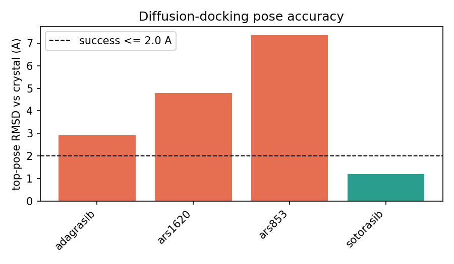
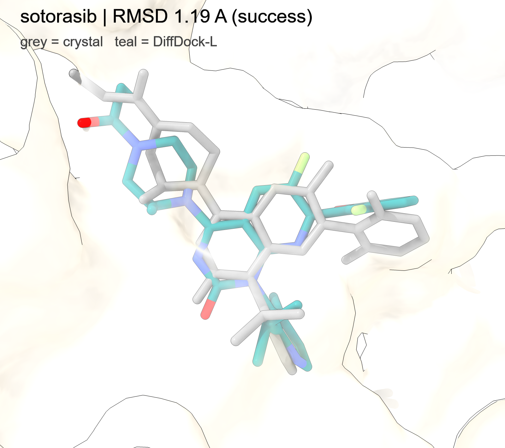
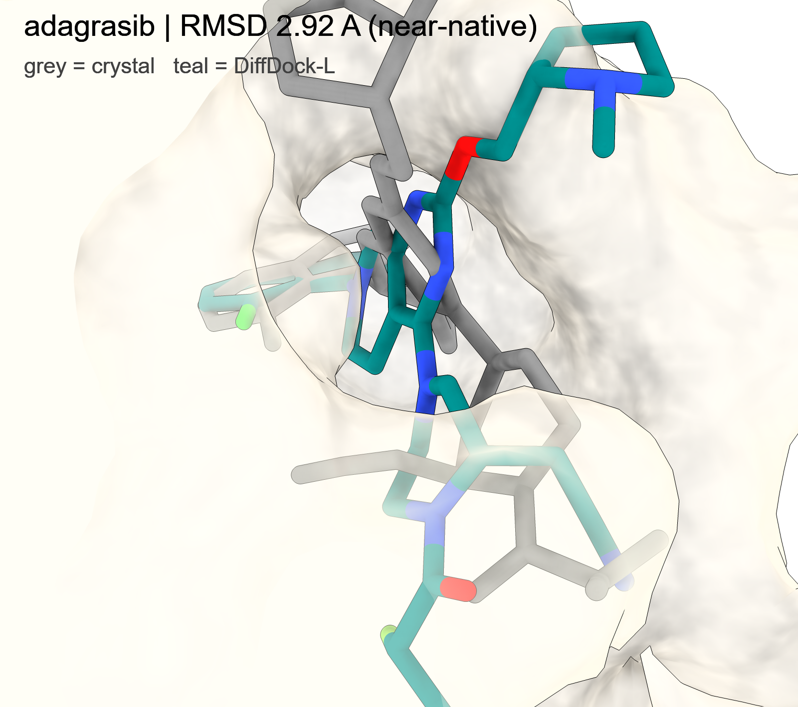

# PhysDock

**Physics-Aware Diffusion Co-Folding & Conformational Sampling for Protein–Ligand Interactions** *An Oncology (KRAS G12C) Case Study & Validation Pipeline*

---

## 🎯 Executive Summary

PhysDock is a modular, reproducible, and inference-optimized computational chemistry pipeline. It integrates state-of-the-art diffusion generative models with rigorous thermodynamic simulations to predict and validate small-molecule binding interactions against complex oncology targets.

Designed for efficiency and falsifiability, PhysDock answers two critical drug discovery questions:

1. **Geometry ("Where does it bind?"):** Utilizing diffusion models to predict structural poses.
2. **Function ("How well does it bind?"):** Utilizing physics-based simulations and neural-network affinity heads to rank candidate efficacy.

The pipeline is engineered with strict MLOps principles: it hard-fails chemically invalid chemistry (and flags PAINS/property/synthetic-accessibility advisories) *before* GPU execution, triangulates predictions across independent AI architectures, and validates all outputs against crystallographic (RMSD) and experimental (pChEMBL) ground truths.

**Hardware Profile:** Engineered to execute end-to-end on a single 24 GB GPU (e.g., AWS A10G), with a decoupled CPU-bound analytical core.

---

## 🧬 The Scientific Architecture

PhysDock orchestrates a multi-tier approach to molecular prediction, explicitly bridging the gap between Machine Learning and Molecular Physics:

* **Tier A (Geometry via Diffusion):** *DiffDock-L* generates a conformational ensemble of ligand poses within a rigid receptor, bypassing traditional heuristic docking searches.
* **Tier B (Induced Fit & Affinity):** *Boltz-2* (AlphaFold3-class architecture) performs joint protein-ligand co-folding from sequences/SMILES to capture dynamic pocket shifts and regresses a predicted binding affinity.
* **Tier C (Thermodynamic Reality Check):** *OpenMM* executes a restrained physics relaxation on the AI-generated poses using Amber14/GAFF2 force fields, quantifying geometric drift and interaction energy to penalize AI hallucinations (e.g., steric clashes).

### 🚀 The Execution Pipeline

| Stage | Script | Core Module | Scientific Objective |
| --- | --- | --- | --- |
| **00** | `00_setup_check.py` | — | **Pre-Flight:** Validates environment dependencies and core CPU logic. |
| **01** | `01_prepare_target.py` | `receptor.py` | **Data Prep:** Cleans receptor, extracts crystal reference poses & SMILES. |
| **02** | `02_chem_gate.py` | `chem.py` | **Triage:** Hard-fails invalid valence/chemistry; flags PAINS/SA/property advisories. |
| **03** | `03_run_diffdock.py` | `docking_diffdock.py` | **Generative AI:** Predicts binding poses via diffusion sampling. |
| **04** | `04_run_boltz.py` | `cofold_boltz.py` | **Co-Folding:** Predicts induced-fit complex and binding affinity. |
| **05** | `05_physics_rescore.py` | `physics_openmm.py` | **Physics:** Evaluates thermodynamic stability and pose drift. |
| **06** | `06_ensemble_analysis.py` | `ensemble.py` | **MD Surrogate:** Analyzes conformational landscape flexibility & clustering. |
| **07** | `07_evaluate_and_report.py` | `evaluate.py` | **Validation:** Calculates RMSD vs. crystal and Spearman rank vs. experiment. |

---

## 📊 Results — KRAS G12C Case Study

The full pipeline was executed end-to-end on real data for **four covalent KRAS G12C inhibitors** — sotorasib, adagrasib, ARS-1620, ARS-853 — using their deposited co-crystal structures (PDB **6OIM, 6UT0, 5V9U, 5F2E**) as ground truth. All three engines (DiffDock-L, Boltz-2, OpenMM/GAFF2) ran on a single 24 GB A10G GPU.

### Pose accuracy (primary result)

Symmetry-aware heavy-atom RMSD between the top-ranked generative pose and the crystallographic pose, computed with `spyrmsd` for all four ligands:

| Ligand | RMSD (Å) | Outcome |
| --- | ---: | --- |
| sotorasib | **1.19** | docking success (sub-2 Å) |
| adagrasib | **2.92** | near-native, correct pocket |
| ARS-1620 | 4.79 | partially displaced |
| ARS-853 | 7.37 | misplaced |



DiffDock-L reproduced the crystallographic pose of **sotorasib to 1.19 Å (an outright docking success, < 2 Å)** and **adagrasib to 2.92 Å (near-native)**, with the remaining two ligands progressively more displaced (4.79 Å, 7.37 Å). The structural overlays below show the crystal pose (grey) against the predicted pose (teal) for the two best cases:

| sotorasib (1.19 Å) | adagrasib (2.92 Å) |
| --- | --- |
|  |  |

This graded outcome is an **expected and reportable characterization, not a failure**: DiffDock-L docks *non-covalently* and applies no constraint tethering the electrophilic warhead to **Cys12**, the residue these inhibitors covalently modify. The pipeline therefore maps the method's **applicability domain** — near-native for part of the set, progressively displaced for the larger/more flexible binders. Run-to-run RMSDs vary by a few tenths of an Å (DiffDock-L is stochastic); the qualitative spread reproduces across independent runs. (Covalent modeling is on the roadmap below.)

### Supporting signals

- **Co-folding (Boltz-2):** high interface confidence for all four complexes (ipTM **0.98**).
- **Predicted affinity:** reported but **statistically underpowered** (n = 4, experimental labels unfilled); no Spearman ρ is claimed. Boltz-2 ranks adagrasib strongest and sotorasib weakest — the latter a transparent miss for a potent clinical drug, recorded rather than omitted.
- **Physics plausibility (OpenMM):** all four poses gave sane interaction-energy proxies (−278 to −476 kJ/mol) and small post-minimization drift (1.0–1.5 Å) — the generative poses are stable under a molecular-mechanics force field. Reported as a relaxation/plausibility proxy, **not** a binding free energy.
- **Conformational consistency:** where more than one pose cleared the confidence gate (ARS-1620), the surviving poses fell into a single binding-mode cluster (spread ≈ 1.6 Å) — DiffDock-L was internally self-consistent rather than scattering hypotheses.

**Not claimed:** no wet-lab validation (all signals *in silico*); the OpenMM term is a proxy, not MM-GBSA/FEP free energy; the affinity correlation is underpowered until experimental labels are added; reported confidences are model self-estimates.

> A full account of every issue surfaced during the first real run — wrong manifest resnames, crystal-coordinate bond-order perception, multi-copy reference SDFs, the DiffDock torch-2 broadcast crash, Boltz's `weights_only` / cuEquivariance failures, and the confidence-gate tuning — and how each was diagnosed and fixed at the source, is documented in the project Summary (`Summary and reminders of PhysDock project.docx`, section *F · Issues/Bugs and fixes*).

---

## 📐 Core Design Philosophy

* **Generative Triangulation:** By utilizing two distinct generative engines (DiffDock and Boltz-2), the pipeline actively seeks consensus. Agreement across models, physics, and ground truth yields a high-confidence hypothesis. Disagreement is explicitly flagged for human review.
* **Ensemble Sampling over MD:** Multi-seed diffusion generation is utilized as a rapid surrogate for computationally prohibitive Molecular Dynamics (MD) simulations, allowing for statistical landscape analysis in minutes rather than weeks.
* **Explicit Physics Integration:** Physics is not hidden in a black-box scoring function. The pipeline exposes inspectable metrics (internal strain, steric clashes, relaxation drift) to ensure predictions obey thermodynamic laws.
* **Falsification over Flattery:** Success is defined strictly by geometric alignment against actual X-ray crystallography (RMSD ≤ 2.0 Å) and statistical rank correlation against wet-lab assays. Underpowered statistics are automatically flagged and rejected.

---

## 🛠️ Quickstart & Usage

The pipeline is decoupled. The analytical core (RDKit, Pandas, Biopython) runs on any local CPU machine for rapid data prep and reporting; the heavy ML/physics engines are added on a GPU box. Because DiffDock-L and the PhysDock/Boltz stack require **mutually incompatible** PyTorch builds, they live in **two separate conda environments**. The main env is captured in `env_physdock.yml`; DiffDock-L's install is order-dependent (PyTorch from the CUDA-12.1 index, then matched PyG wheels, then ProDy `--no-deps`), so it is provided as the script `setup_diffdock.sh` rather than a flat YAML that cannot rebuild.

```bash
# --- analytical core (CPU, any machine) ---
pip install -e .
python scripts/00_setup_check.py          # -> SMOKE TEST PASSED

# --- main environment (physics + Boltz), reproducible from the export ---
conda env create -f env_physdock.yml      # creates 'physdock'
conda activate physdock
pip install torch==2.6.0                   # installed separately to match box CUDA

# --- DiffDock-L in its own environment (its torch stack conflicts with the above) ---
conda create -y -n diffdock python=3.9    # DiffDock-L pins py3.9
bash setup_diffdock.sh                    # ordered install (torch cu121 -> PyG wheels -> ProDy)
git clone https://github.com/gcorso/DiffDock ~/DiffDock
export PHYSDOCK_DIFFDOCK_DIR=~/DiffDock
```

**Two environment requirements learned from the first real run** (see Summary §F):

- **Boltz on PyTorch ≥ 2.6** needs `TORCH_FORCE_NO_WEIGHTS_ONLY_LOAD=1` in the `physdock` env (the official checkpoints pickle OmegaConf objects the safe-unpickler rejects). Set it once, e.g. via a `sitecustomize.py` in the env.
- The config disables the cuEquivariance triangle kernels (`boltz.no_kernels: true`) and pins DiffDock to `--batch_size 1`; both avoid hard crashes on current CUDA/torch builds. Leave them as shipped unless you have pinned the exact legacy stack.

```bash
# --- run the pipeline ---
# CPU stages
python scripts/01_prepare_target.py --config configs/kras_g12c.yaml
python scripts/02_chem_gate.py       --config configs/kras_g12c.yaml
# GPU stages
python scripts/03_run_diffdock.py    --config configs/kras_g12c.yaml
python scripts/04_run_boltz.py       --config configs/kras_g12c.yaml --max-ligands 4
# CPU / mixed
python scripts/05_physics_rescore.py --config configs/kras_g12c.yaml --top-per-ligand 3
python scripts/06_ensemble_analysis.py --config configs/kras_g12c.yaml
python scripts/07_evaluate_and_report.py --config configs/kras_g12c.yaml

# or end-to-end:
bash scripts/run_all.sh configs/kras_g12c.yaml
```

*Outputs are serialized to `results/report/report.md` alongside unified CSV ledgers and figures.*

---

## ⚠️ Data Integrity & Pre-Flight Checks

PhysDock enforces strict data provenance. The project ships with `data/ligands/kras_g12c_ligands.csv`, mapping candidate drugs (e.g., Sotorasib) to their known PDB co-crystal identifiers (e.g., `6OIM`).

Before executing a full run, the researcher **must**:

1. Confirm the `pdb_id` / `ligand_resname` pairing on the RCSB PDB and set `verify=1` in the manifest.
2. Populate the `pchembl` column using `scripts/fetch_chembl_affinities.py` to enable meaningful functional correlation.

*Stage 01 extracts SMILES and spatial coordinates directly from the deposited structures. An incorrect PDB pairing will fail loudly by design, preventing the fabrication of chemistry.*

---

## 📂 Repository Structure

```text
PhysDock/
├── configs/
│   └── kras_g12c.yaml                  # Master execution parameters & thresholds
├── data/
│   └── ligands/kras_g12c_ligands.csv   # Ground-truth co-crystal and affinity manifest
├── physdock/                           # Core Scientific Library
│   ├── chem.py                         # Cheminformatics triage (Valency, SA, PAINS)
│   ├── receptor.py                     # PDB parser & spatial coordinate extractor
│   ├── docking_diffdock.py             # Tier A (Geometry) wrapper & parser
│   ├── cofold_boltz.py                 # Tier B (Affinity) wrapper & parser
│   ├── physics_openmm.py               # Thermodynamic relaxation & strain calculation
│   ├── ensemble.py                     # Conformational clustering & spread analysis
│   └── evaluate.py / report.py         # Statistical correlation & Markdown generation
├── scripts/                            # Orchestration Microservices
│   ├── 00_setup_check.py -> 07_evaluate_and_report.py
│   ├── run_all.sh                      # CI/CD end-to-end execution script
│   └── fetch_chembl_affinities.py      # Auxiliary biological API scraper
├── env_physdock.yml                    # Reproducible conda env (physics + Boltz)
├── setup_diffdock.sh                   # Ordered DiffDock-L env install (replaces a flat YAML)
├── results/report/figures/             # pose_rmsd.png + overlays/ (crystal vs predicted)
├── notebooks/01_quickstart.ipynb       # Interactive tutorial
├── pyproject.toml                      # Modern PEP 517/518 build configuration
├── README.md                           # Project documentation
├── requirements.txt                    # Python package dependencies
├── LICENSE                             # MIT License
└── .gitignore                          # CI/CD exclusions
```

---

## 🔮 Roadmap & Extensions

While this pipeline represents a state-of-the-art inference architecture, future development is targeted at expanding its biophysical scope:

* **Covalent Modeling:** Upgrading the physics engine to explicitly model the covalent adduct formation inherent to KRAS G12C inhibitors (Cys12 warheads), currently treated non-covalently.
* **Enhanced Dynamics:** Integrating learned conformational generators (e.g., AlphaFlow) followed by targeted, short-trajectory OpenMM MD simulations seeded from top AI poses.
* **Free Energy Perturbation (FEP):** Replacing the lightweight interaction energy proxy with full MM-GBSA or FEP calculations for rigorous $\Delta G$ estimations on the shortlisted candidates.
* **Closed-Loop Active Learning:** Connecting the evaluation validation stage directly to a Reinforcement Learning generator to autonomously hypothesize and evaluate novel chemical spaces.